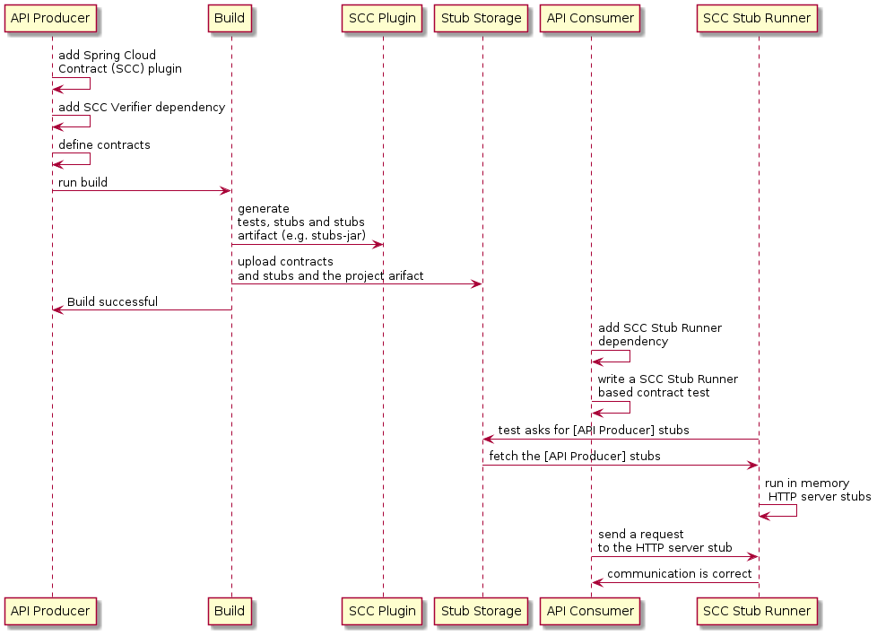

# Demo

This demo only showcase HTTP based contract, and not messaging based contract testing.

## Pact

Image credits to: [oracle](https://blogs.oracle.com/javamagazine/post/how-to-test-java-microservices-with-pact)

- Explain the current codebase in `pact-provider` - See `ProfileController.class`
- Explain the current codebase in `pact-consumer` - See `ProfileClient.class`

With `Pact`, the consumer will start to write contract against the API it consume, this allows the provider to verify and ensure changes done will not break the consumer contract(s)

1. Pact Consumer
   1. Go through `ProfileClientTests`
   2. Run `./gradlew test`
      1. Show the generated contract in `/pact-consumer/build/pacts/`
      2. We can manually copy contract over to provider, instead of using `Pact-Broker` if we wish to
   3. Run `./gradlew build pactPublish`
      1. Show the contract uploaded to `Pact-Broker` - http://localhost:9292
      2. Show the `Pact` on UI

2. Pact Provider
   1. Go through `PactProfileConsumerVerificationTest`
   2. Run `./gradlew clean test -PpublishResults=true`
      1. Show the contract verified at `PactBroker`

## Spring Cloud Contract

Image credits to: [scc](https://docs.spring.io/spring-cloud-contract/docs/current/reference/html/getting-started.html)

- Explain the current codebase in `scc-provider` - See `ProfileController.class`
  - Almost exactly the same as `scc-provider` except it added `ProfileService`
- Explain the current codebase in `scc-consumer`
  - It can be much more simple (in demo), to not even require to write any client class

1. SCC Provider
   1. Go through `getAllProfiles.groovy`
      1. Run `./gradlew generateContractTests`
      2. Show `ContractVerifierTest` created in `build/generated-test-sources/...`
         1. Default will be using `MockMvc`, alternative are `JAXRS, WEBTESTCLIENT, SPOCK`
         2. What it generates here, is only the test method with assertion
         3. What we lack of here now, is the test implementation (see `BaseProfileContractTest`)
   2. Go through `BaseProfileContractTest`
      1. Go through `BaseProfileContractTest`
      2. Run `./gradlew contractTest`
         1. This will run the actual test
         2. Notice the response defined in the contract matches the one defined in the `mocks` we defined in `BaseProfileContractTest`. If `mocks` are not used, then it will run against the actual method, to verify agains the actual value which would most likely fail
            1. If we have time, we can maybe change the `mocks` return value to something, and run again, this time, it should fail
   3. Next, we have to publish the `stub` for consumer to consume
      1. Show `build.gradle` for the configuration
      2. Run `./gradlew publishToMavenLocal`
         1. Show it being published to `%USERPROFILE%/.m2/repository/com/bwgjoseph/scc-provider/0.0.1-SNAPSHOT`

2. SCC Consumer
   1. Show `ProfileConsumerTests`