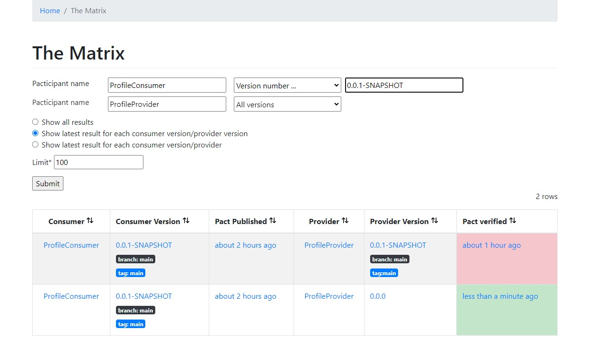

# Spring Boot Consumer Driven Contract Demo

This project is written to attempt to understand more about `Consumer Driven Contract` with the use of Spring Boot + [Pact](https://pact.io/) / [Spring Cloud Contract](https://spring.io/projects/spring-cloud-contract)

- [Spring Boot Consumer Driven Contract Demo](#spring-boot-consumer-driven-contract-demo)
  - [Project](#project)
    - [Run](#run)
    - [Build](#build)
  - [Pact CDC](#pact-cdc)
    - [Consumer](#consumer)
      - [ProfileClientTests](#profileclienttests)
      - [Generate](#generate)
    - [Provider](#provider)
      - [PactProfileConsumerVerificationTest](#pactprofileconsumerverificationtest)
    - [Broker](#broker)
      - [Consumer](#consumer-1)
      - [Provider](#provider-1)
    - [Tips](#tips)
    - [Known Issue](#known-issue)
    - [Snippet](#snippet)
      - [PactDslJsonBody](#pactdsljsonbody)
      - [PactDslJsonArray](#pactdsljsonarray)
  - [Spring Cloud Contract CDC](#spring-cloud-contract-cdc)
    - [Provider](#provider-2)
    - [Consumer](#consumer-2)
    - [Known Issue](#known-issue-1)
  - [Consideration](#consideration)
    - [Developer Experience](#developer-experience)
      - [Documentation](#documentation)
      - [Tooling Support](#tooling-support)
    - [Features](#features)
  - [Further exploration](#further-exploration)
  - [Reference](#reference)

## Project

This repository includes four distinct sub-project;

- [pact-consumer](./pact-consumer/)
- [pact-provider](./pact-provider/)
  - Provides two API
    - GET /profiles
    - GET /profiles/{id}

- [scc-provider](./scc-provider/)
- [scc-consumer](./scc-consumer/)

### Run

Navigate to the individual directory and run

```bash
./gradlew bootRun
```

### Build

Navigate to the individual directory and run

```bash
./gradlew [clean] build
```

## Pact CDC

### Consumer

#### ProfileClientTests

- Add `@ExtendWith(PactConsumerTestExt.class)` at class level
  - For `JUnit 5` which replaces `PactRunner` in `JUnit 4`
- Add `@PactTestFor` at class level
  - This starts a `MockServer` for the consumer to run the test against which is why we have to set this `this.profileClient.setBaseUrl(mockServer.getUrl());` within the test to replace the actual URL with the `MockServer` one
  - Define `providerName`
    - When `Provider` run the test, it will specify `@Provider("ProfileProvider")` to match against `providerName`
- Define the different interaction expectation
  - For each different API interaction, define a `@Pact` method to represent the expected response
  - At minimal, define the `consumer` parameter
    - This will result in generating the expectation into a single contract per provider
    - Contracts are generated based on unique `[Consumer]-[Provider].json` naming
- For each `@Test`
  - Specify `@PactTestFor(pactMethod = "getAllProfiles")` where `pactMethod` refers to the method annotated with `@Pact`
  - This is so that it knows which method to retrieve the expected response from

Need further understanding on what it means for [matching the interactions by provider name](https://docs.pact.io/implementation_guides/jvm/consumer/junit5#matching-the-interactions-by-provider-name) and [matching the interactions by method name](https://docs.pact.io/implementation_guides/jvm/consumer/junit5#matching-the-interactions-by-method-name)

#### Generate

Once the test are written, to generate the contract, run

```
./gradlew test
```

or

```
./gradlew build
```

Once completed, it will output the generated consumer contract to `/pact-consumer/build/pacts/` which can then be copied to provider project for verification

### Provider

As we are not using `Pact Broker/Server` at this stage, we have to manually copy the contract that was generated by the `Consumer` and place it on `/pact-provider/pacts` directory

#### PactProfileConsumerVerificationTest

- Add `@Provider("ProfileProvider")` at class level
  - Note `ProfileProvider` is the same as defined in consumer `@PactTestFor(providerName)`
- Add `@PactFolder("pacts")` at class level
  - To indicate where to grab the `contract` from
  - If we are using broker, then this is not necessary and will be replaced by `@PactBroker` annotation
- Note that for Spring Provider, we have to bring in `au.com.dius.pact.provider:junit5spring` package instead of `au.com.dius.pact.provider:junit5`
- Add `@ExtendWith(PactVerificationSpringProvider.class)` and `@TestTemplate`
  - This setup to run against all the contracts defined by `Consumer`
- Add `@BeforeEach`
  - This setup the "test client" to run against the `Provider`
  - See [test-target docs](https://docs.pact.io/implementation_guides/jvm/provider/junit5#test-target)
  - For `Spring`, it supports additional [test targets](https://docs.pact.io/implementation_guides/jvm/provider/junit5spring#modifying-requests) like `MockMvcTestTarget` and `WebFluxTarget`
- Add `@State`
  - With `value` that should match against `Consumer.@Pact.given` state
  - `State` is to help to provide `data` specifically for the contract test, and not rely on the actual data (state) of the application (especially if it reads from the database)
  - The default `state.action` is `StateChangeAction.SETUP` so can ignore unless it's `TEARDOWN`
  - The body of `@State` is to mock the return of the actual value to be returned (so it work the same just like normal mocking would)
    - In this case, we add `@MockBean` to `ProfileController` and set the return value
    - In the event that there was some call to other component, then we will just mock that component return value

Not quite sure why the need to explicitly indicate each `@State` although I think it doesn't have to but can't find the docs for it yet

### Broker

As mentioned earlier, without using `Broker`, we need to transfer the generated contract from the `Consumer` to `Provider` manually. However, with `Broker`, we can simply ask the `Consumer` to publish the `contracts` to `Broker`, and the `Provider` will read and verify the `contracts` from the `Broker`. This allows for even more seamless integration test and the `Broker` also has UI to view the result

To startup the broker, navigate to root directory and run

```
docker-compose up -d
```

Access via http://localhost:9292

#### Consumer

- Add `id 'au.com.dius.pact' version '4.4.0-beta.2'` to `build.gradle > plugins`
- Add `pack.broker` and `pack.publish` information - see `build.gradle`
  - Note that some properties can be configured as [JVM System Properties](https://github.com/pact-foundation/pact-jvm/blob/master/provider/gradle/README.md#configured-as-jvm-system-properties) or [Environment Variables](https://github.com/pact-foundation/pact-jvm/blob/master/provider/gradle/README.md#configured-as-environment-variables)
- Run `./gradlew build pactPublish`

Once published, we can see that the `Contract` is listed in the `Broker`


Interestingly, we can also review the `contract` written by the `Consumer`


This allows us to manually verify the contract is written correctly as well

#### Provider

- For `Provider` with `Spring`, we just need to provide some configuration and it will be able to read the `contracts` from the `Broker`
- It is not necessary to bring in `au.com.dius.pact` gradle plugin as we can rely on `JUnit Test` to [publish the result](https://github.com/pact-foundation/pact-jvm/issues/1567#issuecomment-1157275733) via `property`
  - `gradle plugin` in necessary if you wish to use `pactVerify` gradle command
- Navigate to `application.properties` and add
```
pactbroker.host: localhost
pactbroker.port: 9292
pactbroker.auth.username: pact
pactbroker.auth.password: pact
```
- Switch out `@PactFolder` with `@PactBroker`
  - It is also possible to configure host, auth, etc through `@PactBroker`

Before we verify the result, we can take a look at the `Matrix` page


- To verify and publish the result
  - ~~Add `pack.broker` and `pact.serviceProviders` in `build.gradle`~~
  - ~~Add `pact.verifier.publishResults=true` in `gradle.properties`~~
  - ~~Run `./gradlew build pactVerify`~~
  - Configure `test` task as such
    ```groovy
    tasks.named('test') {
      useJUnitPlatform()

      if (project.hasProperty("publishResults")) {
          systemProperty "pact.verifier.publishResults", project.publishResults
      }
    }
    ```
  - Run `./gradlew clean test -PpublishResults=true`

> The reason to set to `publishResults` is because for some reason either PowerShell or Gradle doesn't like `pact` as a property, and [stripped](https://github.com/pact-foundation/pact-jvm/issues/1567#issuecomment-1157269806) it off, hence, we pass in using `publishResults` which still get recognize as `pact.verifier.publishResults`



### Tips

- Consider adding `@Tags` to `Pact` test suite and then configure `test` task to exclude `@Tags("pact")`
  - This is so that the usual test won't run test tag with `pact`
  - See [this](https://stackoverflow.com/questions/64322037/how-to-publish-pact-verification-result-to-pact-broker-in-gradle)

### Known Issue

- Since `au.com.dius.pact.consumer:junit5:4.3.0` onwards, when running the test, it will throw error `java.lang.UnsupportedOperationException: Method getSingleProfile does not conform required method signature 'public au.com.dius.pact.core.model.V4Pact xxx(PactBuilder builder)'`
  - See [test-report](issues/pact-4.3.0/test/index.html), most likely related to this [issue](https://github.com/pact-foundation/pact-jvm/issues/1488) and this [note](https://docs.pact.io/implementation_guides/jvm/upgrade-to-4.3.x)
  - To overcome this, we can change to `PactSpecVersion.V3` like such `@PactTestFor(providerName = "ProfileProvider", pactVersion = PactSpecVersion.V3)`
  - Seem like `PactSpecVersion.V4` is the default, and is incompatible with `V3`
- When running the test via `VSCode` (manual click), `pact` generated contract will be output to `target/pact` even though using `gradle`. However, if running via command `./gradlew build`, there won't be such issue
- Unable to publish verification result to broker after running `./gradlew pactVerify` command. Have reported the [issue](https://github.com/pact-foundation/pact-jvm/issues/1567).
  - Managed to get the result published after some help but still facing issue when using with `gradle plugin`

### Snippet

#### PactDslJsonBody

```java
// {
//     "profiles": [
//         {
//             "id": 1,
//             "name": "Joseph",
//             "age": 22,
//             "email": "jose@gmail.com",
//             "dob": "2000-01-01"
//         },
//     ]
// }
new PactDslJsonBody()
    .minArrayLike("profiles", 1, 1)
        .integerType("id", 1)
        .stringType("name", "fake")
        .integerType("age", 10)
        .stringType("email", "fake@gmail.com")
        .date("dob")
        .closeObject()
    .closeArray()
```

#### PactDslJsonArray

```java
// [
//     {
//         "id": 1,
//         "name": "Joseph",
//         "age": 22,
//         "email": "jose@gmail.com",
//         "dob": "2000-01-01"
//     }
// ]
PactDslJsonArray.arrayEachLike()
    .integerType("id", 1)
    .stringType("name", "fake")
    .integerType("age", 10)
    .stringType("email", "fake@gmail.com")
    .date("dob")
.closeObject()
```

## Spring Cloud Contract CDC

If the project was generated via `start.spring.io`, note that the default configuration generated is wrong. See [#938](https://github.com/spring-io/start.spring.io/issues/938)

Change from

```groovy
tasks.named("contracts") {
    testFramework = org.springframework.cloud.contract.verifier.config.TestFramework.JUNIT5
}
```

to

```groovy
contracts {
    testFramework = org.springframework.cloud.contract.verifier.config.TestFramework.JUNIT5
    // add this to allow build when no contract is written yet
    failOnNoContracts = false
}
```

### Provider

*** https://docs.spring.io/spring-cloud-contract/docs/current/reference/html/gradle-project.html#gradle-add-stubs

- Create the contract in `/test/resources/contracts/` which can be in `groovy, java, yaml, kotlin`
  - Choose `groovy` as it seem the most friendly out of all to write the contract in
- Create Base class in `/test/java/com/bwgjoseph/sccprovider/contracts`.
  - The base class and contract is used to define the testing behavior
- Define the base class in `build.gradle` under `contracts` extension
  - `baseClassForTests = 'com.bwgjoseph.sccprovider.contracts.ContractsBase'`
- Run `./gradlew generateContractTests` to generate the contract
  - By default, it will be invoked before `check` task
- However, in order for `Consumer` to consume the `contract`, we need a way to publish the `stub` for consume to "consume".
  - To do so, we will add [maven-publish](https://docs.gradle.org/current/userguide/publishing_maven.html) plugin
    - We only publish to local `.m2/repository` but if there is a remote repository available, it can be published there as well. Publishing to local just makes our development easier
  - Configure this
    ```groovy
    publishing {
        publications {
            mavenJava(MavenPublication) {
                // Refer to https://docs.spring.io/spring-boot/docs/current/gradle-plugin/reference/htmlsingle/#publishing-your-application.maven-publish
                artifact bootJar
                // See https://docs.spring.io/spring-cloud-contract/docs/current/reference/html/gradle-project.html#gradle-publishing-stubs-to-artifact-repo
                artifact verifierStubsJar
            }
        }
    }
    ```
  - And run `./gradlew publishToMavenLocal`
  - Once completed, you will be able to find a local copy of the app and stub in `%USERPROFILE%/.m2/repository` directory


> Skipped testing for date, see [scc-localdatetime-assertions-fail](https://stackoverflow.com/questions/60550853/spring-cloud-contract-localdatetime-assertions-fail)

```
ContractVerifierTest > validate_getAllProfiles() FAILED
    java.lang.IllegalStateException: Parsed JSON [[{"id":1,"name":"Joseph","age":22,"email":"jose@gmail.com","dob":[2000,1,1]}]] doesn't match the JSON path [$[?(@.['dob'] == '2000-1-1')]]
        at com.toomuchcoding.jsonassert.JsonAsserter.check(JsonAsserter.java:228)
        at com.toomuchcoding.jsonassert.JsonAsserter.checkBufferedJsonPathString(JsonAsserter.java:267)
        at com.toomuchcoding.jsonassert.JsonAsserter.isEqualTo(JsonAsserter.java:101)
        at com.bwgjoseph.sccprovider.contracts.ContractVerifierTest.validate_getAllProfiles(ContractVerifierTest.java:39)
```

As `SCC` also verify the actual value, which will trigger the actual method call to get the value, it will most likely mismatch and fail the test. So we have to `mock` the value via `Mockito`, and the easier way is to create a separate service to call from controller, so that we can mock that service return value more easily. Unlike `pact` where the actual value is less important(? to verify)

### Consumer

Generate the project from [start.spring.io](https://start.spring.io/#!type=gradle-project&language=java&platformVersion=2.7.0&packaging=jar&jvmVersion=17&groupId=com.bwgjoseph&artifactId=scc-consumer&name=scc-consumer&description=Spring%20Boot%20SCC%20Consumer&packageName=com.bwgjoseph.scc-consumer&dependencies=devtools,lombok,configuration-processor,web,cloud-contract-stub-runner)

- Add `ProfileConsumerTests`
  - Add `@AutoConfigureStubRunner(ids = "com.bwgjoseph:scc-provider:+:stubs:8100", stubsMode = StubsMode.LOCAL)`
    - We configure the stub to run at `port 8100`
    - and `StubsMode` to `LOCAL` so it will pull from local maven repository, instead of `REMOTE`

That's actually all is required to run a the test against the `stub`

### Known Issue

- `start.spring.io` [wrongly generated](https://github.com/spring-cloud/spring-cloud-contract/issues/1795) `contracts` as `task` instead of `extension` for `gradle`

## Consideration

- Consumer Driven Contract [Pact] vs Provider Driven Contract [SCC]
- Ease of use
- Learning curve / Overhead

### Developer Experience

#### Documentation

- Both libraries don't provide the best out-of-the-box experience to start as the documentation seem to jump all around, and are quite confusing (sometimes)

#### Tooling Support

- So far, I am using `gradle` to test in my demo, and online is lacking on the support for `gradle`. Most of the example are written using `maven`, and my attempt to use `gradle` has faced multiple issues.
  - Especially when an error occurs, it wasn't quite clear of what exactly is happening. I have to enable `--info or --debug` to see what exactly is the issue
  - One example was when using `SCC`, in my contract, I did not enclose the `response.body.email` with quotes, but the error was pointing at `Line 5` of the `getAllProfiles.groovy` file which was the start of the contract and was able to know when I turn on `--debug` mode
- To be fair, if I had chose to use `maven`, the experience should have been better

### Features

- In `Pact`, `consumer` writes what fields are required in the `contract` before submitting, and `provider` run against it
- In `SCC`, `provider` provides the `stub` and `consumer` run against the `stub`, then verify if the fields they need are there
- In `SCC`, it seem less straightforward to write contract against `Date`

## Further exploration

Possibly look into using [Spring Cloud Contract](https://spring.io/projects/spring-cloud-contract#overview) with [pact-broker](https://cloud.spring.io/spring-cloud-contract/reference/html/howto.html#how-to-use-pact-broker)

## Reference

- [pact-workshop-Maven-Springboot-JUnit5](https://github.com/pact-foundation/pact-workshop-Maven-Springboot-JUnit5)
- [contract-test-spring-cloud-contract-vs-pact](https://blog.devgenius.io/contract-test-spring-cloud-contract-vs-pact-420450f20429)
- [pact-jvm-example](https://arxman.com/pact-jvm-example/)
- [consumer-driven-contract-tests-lessons-learned](https://medium.com/kreuzwerker-gmbh/consumer-driven-contract-tests-lessons-learned-b4e1ac471d0c)
- [okta-spring-cloud-contract](https://developer.okta.com/blog/2022/02/01/spring-cloud-contract)
- [scc-contract-dsl-http-top-level-elements](https://docs.spring.io/spring-cloud-contract/docs/current/reference/html/project-features.html#contract-dsl-http-top-level-elements)
- [gradle-springboot-mavenpublish-publication-only-contains-dependencies](https://stackoverflow.com/questions/61500897/gradle-springboot-mavenpublish-publication-only-contains-dependencies-and-or)
- [continuous-integration-with-jenkins-artifactory-and-spring-cloud-contract](https://piotrminkowski.com/2018/07/04/continuous-integration-with-jenkins-artifactory-and-spring-cloud-contract/)