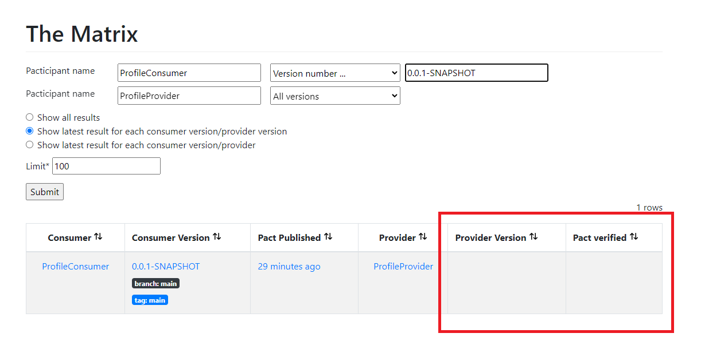
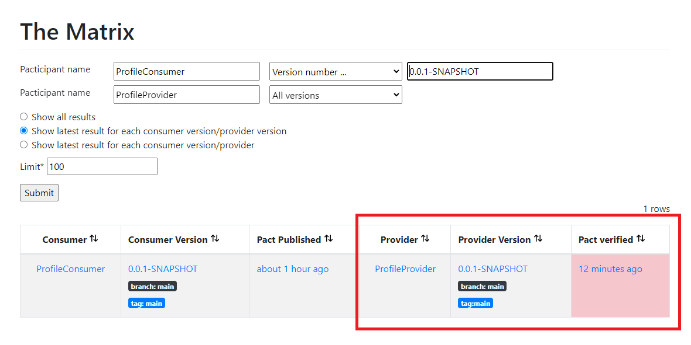

# Spring Boot Pact Demo

This project is written to attempt to understand more about `Consumer Driven Contract` with the use of Spring Boot + [Pact](https://pact.io/)

## Project

This repository includes two sub-project;

- [pact-consumer](./pact-consumer/)
- [pact-provider](./pact-provider/)
  - Provides two API
    - GET /profiles
    - GET /profiles/{id}

### Run

Navigate to the individual directory and run

```bash
./gradlew bootRun
```

### Build

Navigate to the individual directory and run

```bash
./gradlew [clean] build
```

## Contract

### Consumer

#### ProfileClientTests

- Add `@ExtendWith(PactConsumerTestExt.class)` at class level
  - For `JUnit 5` which replaces `PactRunner` in `JUnit 4`
- Add `@PactTestFor` at class level
  - This starts a `MockServer` for the consumer to run the test against which is why we have to set this `this.profileClient.setBaseUrl(mockServer.getUrl());` within the test to replace the actual URL with the `MockServer` one
  - Define `providerName`
    - When `Provider` run the test, it will specify `@Provider("ProfileProvider")` to match against `providerName`
- Define the different interaction expectation
  - For each different API interaction, define a `@Pact` method to represent the expected response
  - At minimal, define the `consumer` parameter
    - This will result in generating the expectation into a single contract per provider
    - Contracts are generated based on unique `[Consumer]-[Provider].json` naming
- For each `@Test`
  - Specify `@PactTestFor(pactMethod = "getAllProfiles")` where `pactMethod` refers to the method annotated with `@Pact`
  - This is so that it knows which method to retrieve the expected response from

Need further understanding on what it means for [matching the interactions by provider name](https://docs.pact.io/implementation_guides/jvm/consumer/junit5#matching-the-interactions-by-provider-name) and [matching the interactions by method name](https://docs.pact.io/implementation_guides/jvm/consumer/junit5#matching-the-interactions-by-method-name)

#### Generate

Once the test are written, to generate the contract, run

```
./gradlew test
```

or

```
./gradlew build
```

Once completed, it will output the generated consumer contract to `/pact-consumer/build/pacts/` which can then be copied to provider project for verification

### Provider

As we are not using `Pact Broker/Server` at this stage, we have to manually copy the contract that was generated by the `Consumer` and place it on `/pact-provider/pacts` directory

#### PactProfileConsumerVerificationTest

- Add `@Provider("ProfileProvider")` at class level
  - Note `ProfileProvider` is the same as defined in consumer `@PactTestFor(providerName)`
- Add `@PactFolder("pacts")` at class level
  - To indicate where to grab the `contract` from
  - If we are using broker, then this is not necessary and will be replaced by `@PactBroker` annotation
- Note that for Spring Provider, we have to bring in `au.com.dius.pact.provider:junit5spring` package instead of `au.com.dius.pact.provider:junit5`
- Add `@ExtendWith(PactVerificationSpringProvider.class)` and `@TestTemplate`
  - This setup to run against all the contracts defined by `Consumer`
- Add `@BeforeEach`
  - This setup the "test client" to run against the `Provider`
  - See [test-target docs](https://docs.pact.io/implementation_guides/jvm/provider/junit5#test-target)
  - For `Spring`, it supports additional [test targets](https://docs.pact.io/implementation_guides/jvm/provider/junit5spring#modifying-requests) like `MockMvcTestTarget` and `WebFluxTarget`
- Add `@State`
  - With `value` that should match against `Consumer.@Pact.given` state
  - `State` is to help to provide `data` specifically for the contract test, and not rely on the actual data (state) of the application (especially if it reads from the database)
  - The default `state.action` is `StateChangeAction.SETUP` so can ignore unless it's `TEARDOWN`
  - The body of `@State` is to mock the return of the actual value to be returned (so it work the same just like normal mocking would)
    - In this case, we add `@MockBean` to `ProfileController` and set the return value
    - In the event that there was some call to other component, then we will just mock that component return value

Not quite sure why the need to explicitly indicate each `@State` although I think it doesn't have to but can't find the docs for it yet

### Broker

As mentioned earlier, without using `Broker`, we need to transfer the generated contract from the `Consumer` to `Provider` manually. However, with `Broker`, we can simply ask the `Consumer` to publish the `contracts` to `Broker`, and the `Provider` will read and verify the `contracts` from the `Broker`. This allows for even more seamless integration test and the `Broker` also has UI to view the result

To startup the broker, navigate to root directory and run

```
docker-compose up -d
```

Access via http://localhost:9292

#### Consumer

- Add `id 'au.com.dius.pact' version '4.4.0-beta.2'` to `build.gradle > plugins`
- Add `pack.broker` and `pack.publish` information - see `build.gradle`
  - Note that some properties can be configured as [JVM System Properties](https://github.com/pact-foundation/pact-jvm/blob/master/provider/gradle/README.md#configured-as-jvm-system-properties) or [Environment Variables](https://github.com/pact-foundation/pact-jvm/blob/master/provider/gradle/README.md#configured-as-environment-variables)
- Run `./gradlew build pactPublish`

Once published, we can see that the `Contract` is listed in the `Broker`


Interestingly, we can also review the `contract` written by the `Consumer`


This allows us to manually verify the contract is written correctly as well

#### Provider

- For `Provider` with `Spring`, we just need to provide some configuration and it will be able to read the `contracts` from the `Broker`
- Navigate to `application.properties` and add
```
pactbroker.host: localhost
pactbroker.port: 9292
pactbroker.auth.username: pact
pactbroker.auth.password: pact
```
- Switch out `@PactFolder` with `@PactBroker`
  - It is also possible to configure host, auth, etc through `@PactBroker`

Before we verify the result, we can take a look at the `Matrix` page



- To verify and publish the result
  - Add `pack.broker` and `pact.serviceProviders` in `build.gradle`
  - Add `pact.verifier.publishResults=true` in `gradle.properties`
  - Run `./gradlew build pactVerify`



## Tips

- Consider adding `@Tags` to `Pact` test suite and then configure `test` task to exclude `@Tags("pact")`
  - This is so that the usual test won't run test tag with `pact`
  - See [this](https://stackoverflow.com/questions/64322037/how-to-publish-pact-verification-result-to-pact-broker-in-gradle)

## Consideration

- Consumer Driven Contract [Pact] vs Provider Driven Contract [SCC]
- Ease of use
- Learning curve / Overhead

## Snippet

### PactDslJsonBody

```java
// {
//     "profiles": [
//         {
//             "id": 1,
//             "name": "Joseph",
//             "age": 22,
//             "email": "jose@gmail.com",
//             "dob": "2000-01-01"
//         },
//     ]
// }
new PactDslJsonBody()
    .minArrayLike("profiles", 1, 1)
        .integerType("id", 1)
        .stringType("name", "fake")
        .integerType("age", 10)
        .stringType("email", "fake@gmail.com")
        .date("dob")
        .closeObject()
    .closeArray()
```

### PactDslJsonArray

```java
// [
//     {
//         "id": 1,
//         "name": "Joseph",
//         "age": 22,
//         "email": "jose@gmail.com",
//         "dob": "2000-01-01"
//     }
// ]
PactDslJsonArray.arrayEachLike()
    .integerType("id", 1)
    .stringType("name", "fake")
    .integerType("age", 10)
    .stringType("email", "fake@gmail.com")
    .date("dob")
.closeObject()
```

## Further exploration

Possibly look into using [Spring Cloud Contract](https://spring.io/projects/spring-cloud-contract#overview) with [pact-broker](https://cloud.spring.io/spring-cloud-contract/reference/html/howto.html#how-to-use-pact-broker)

## Known Issue

- Since `au.com.dius.pact.consumer:junit5:4.3.0` onwards, when running the test, it will throw error `java.lang.UnsupportedOperationException: Method getSingleProfile does not conform required method signature 'public au.com.dius.pact.core.model.V4Pact xxx(PactBuilder builder)'`
  - See [test-report](issues/pact-4.3.0/test/index.html), most likely related to this [issue](https://github.com/pact-foundation/pact-jvm/issues/1488) and this [note](https://docs.pact.io/implementation_guides/jvm/upgrade-to-4.3.x)
  - To overcome this, we can change to `PactSpecVersion.V3` like such `@PactTestFor(providerName = "ProfileProvider", pactVersion = PactSpecVersion.V3)`
  - Seem like `PactSpecVersion.V4` is the default, and is incompatible with `V3`
- When running the test via `VSCode` (manual click), `pact` generated contract will be output to `target/pact` even though using `gradle`. However, if running via command `./gradlew build`, there won't be such issue
- Unable to publish verification result to broker after running `./gradlew pactVerify` command. Have reported the [issue](https://github.com/pact-foundation/pact-jvm/issues/1567). Awaiting for assistance.

## Reference:

- [pact-workshop-Maven-Springboot-JUnit5](https://github.com/pact-foundation/pact-workshop-Maven-Springboot-JUnit5)
- [contract-test-spring-cloud-contract-vs-pact](https://blog.devgenius.io/contract-test-spring-cloud-contract-vs-pact-420450f20429)
- [pact-jvm-example](https://arxman.com/pact-jvm-example/)